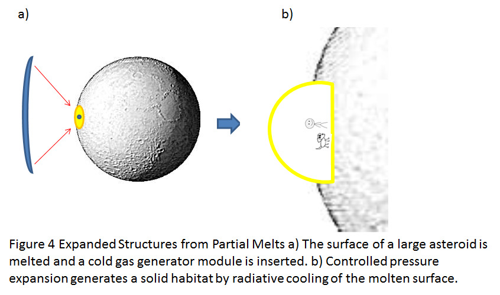

# LGPEM
Low Gravity Pressure Expanded Manufacturing
I was dreaming of submitting this idea for a NASA NIAC grant but ... 

Summary:  

  The proposal will describe how the high vacuum, microgravity environment of space can be exploited to enable the manufacturing of high value structures in orbit without complex space-based infrastructure.  

  On earth, the science and art of glass blowing has been practiced for two thousand years.  The particular material properties of molten silicon dioxide allow the glass blower to create hollow symmetric structures using pressure expansion, despite the gravitational forces on earth that tend to cause them to collapse.  In a microgravity environment, the number of materials that could be similarly patterned by pressure expansion is much larger.  Under the influence of gravity, the viscosity of a material must be very high in its liquid form and the phase transition from liquid to solid must occur quickly so that the manufactured object resists deformation.  In the absence of gravity, the constraints on viscosity and phase transition time are relaxed.  

  Additionally, the high vacuum environment above the earth’s atmosphere further relaxes the constraints on materials that can used for low gravity pressure expanded manufacturing (LGPEM).

  There are four types of LGPEM that could be explored:

  1. Templated Expansion:

Depicted in figure 1, templated expansion consists of inserting a foil balloon made of a high melting metal (e.g. Titanium) into a molten sphere of a lower melting point material (e.g. aluminum).  Controlled inflation of the foil balloon and subsequent cooling of the molten metal would result in hollow structure of shape of the balloon template.  Using this type of pressure expanded structure it might be possible to form large robust parabolic mirrors from compact material slugs.

  2. Simple Expansion:

The expansion of a molten material by the simple injection of pressurized gas is depicted in figure 2.  The expansion of these structures is limited by the physical properties of the melted materials and the pressure of the gas used to expand the manufactured element (usually a sphere in the case of simple expansion)  This type of structure has a constrained set of materials suitable for use in their fabrication but is very interesting because these LGPEM derived structures are essentially unlimited as to how large they can be.  Simple expansion techniques could generate HUGE hollow structures suitable for space stations.

  Using concentrated sunlight to melt a suitable near earth asteroid and a cold gas generator to expand the melted material to an enormous hollow sphere is the application of this type of LGPEM that I find truly exciting.

  3. Embossed Expanded structures:

Figure 3 depicts the case of Embossed LGPEM.  In this type of expanded structure the simple expansion of a material is constrained by elements external growing melt.  A simple example of this type of structure would be a shaped titanium balloon that contains an expanding sphere of molten aluminum.

 4.  Expanded Structures from Partial Melts:

The possibilities of LGPEM extend to the generation of hollow cavities in large bodies that are not fully melted.  An example of this structure could be the use of pressurised gas to expand hollow cavities in the surface of a very large asteroid where only a portion of the surface of the large celestial body could be melted by concentrated sunlight (figure 4).  This might also be possible on the lunar regiolith where LGPEM might generate hollow structures suitable for lunar habitats.

  5. Bubble Nest Strategy

Using a bio-inspired approach, foamed metal composed of small spherical elements could be formed by various means to generate large structures of arbitrary shape and size.

Combinations of the above strategies could lead to complex manufactured elements.  Without the limits of atmosphere and gravity,  the possibilities of pressure expanded structures in orbit are much greater than even those of traditional glass blown products here on earth, which 2000 years refinement have informed.  

YUM YUM.

Thanks for reading!
